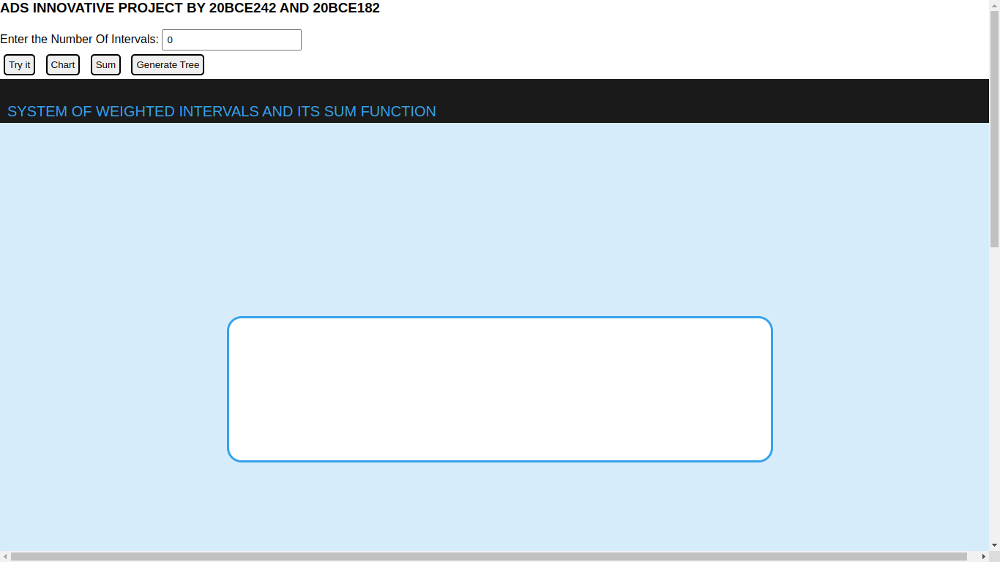
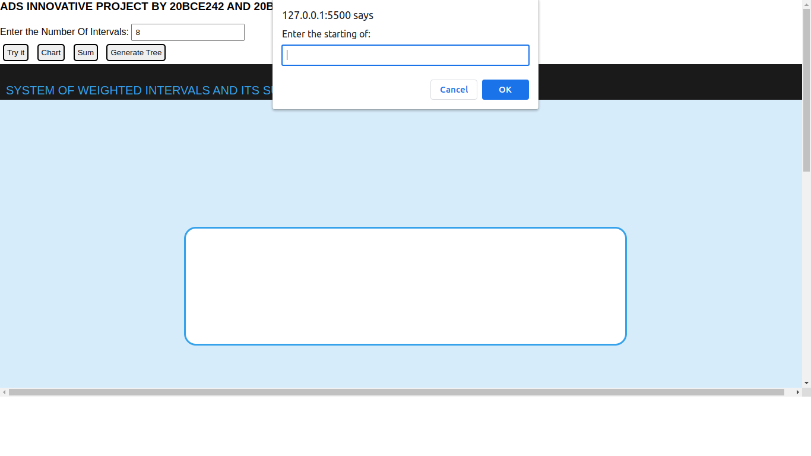
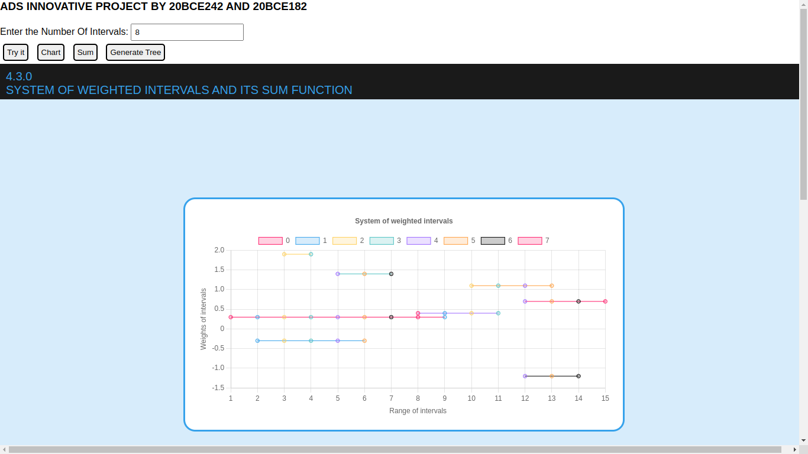
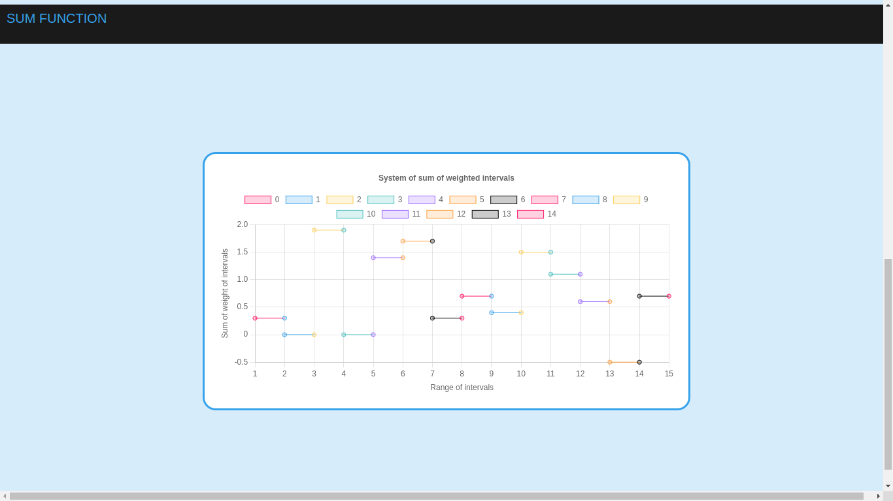
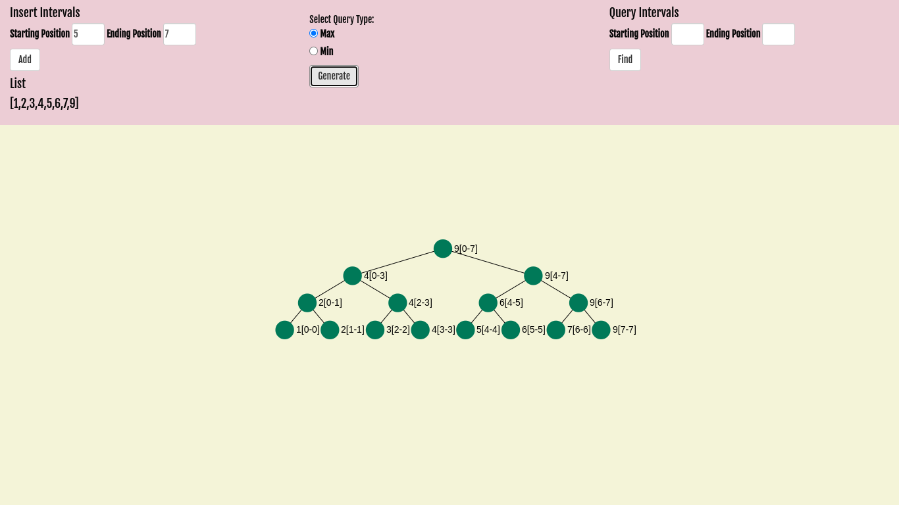
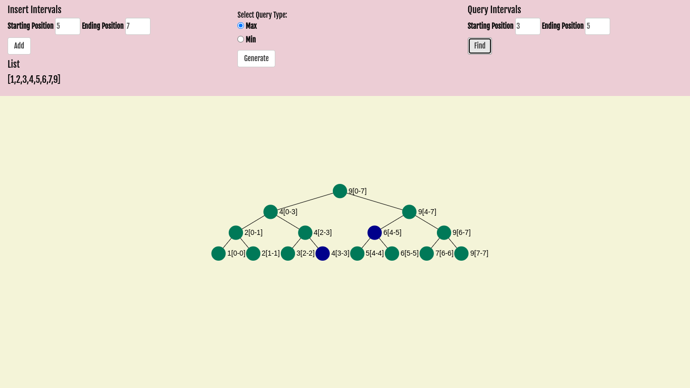

# System of Weighted Intervals and Its Sum Function

Trees for Sums of Weighted Intervals, also known as Segment Trees or Interval Trees, is a data structure used for efficiently computing the sum of weights over a range of intervals in an array. It is especially useful when the array is large and dynamic, meaning that elements are added or removed frequently.

In this data structure, a binary tree is constructed where each node represents an interval of values in the input array. The root node represents the entire array, and its two child nodes represent the left and right halves of the array. Each node stores the sum of the weights of all the intervals that overlap with that node's interval.

The tree is built recursively by dividing the input array into two equal halves and building a node for each half. Each node's interval is the union of its child nodes' intervals. The weights of the intervals are calculated and stored in each node. This process continues recursively until each leaf node represents a single element in the array.

To compute the sum of weights over a range of intervals, the tree is traversed starting from the root node. At each node, the sum of the weights of all overlapping intervals is calculated and added to the sum. The traversal continues recursively on the child nodes whose intervals overlap with the queried interval.

The time complexity of building the tree is O(n log n), where n is the size of the input array. The time complexity of a query is O(log n), which makes this data structure very efficient for computing sums of weighted intervals for large arrays.

This data structure has many applications, including range queries in databases, computational geometry, and dynamic programming problems in computer science.

## Screenshots

Run this "WeightedsumOfIntervals/index.html" file to get interface of System of Weighted Intervals and Its Sum Function

After entering the number of Intervals , press on TryIt button then enter the starting,ending and weight of intervals.

Press chart button to generate graph of interval system.  

Press Sum Button to generate Sum of Weighted Intervals System.

Press "Generate Tree", then enter starting and ending position of intervals to generate segment tree. max generates larger parents among two children using bottom up approach as well as min works.

we can identify which nodes are between given range of intervals using "find" button.
